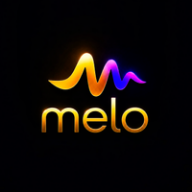

  

<h1 align="center">Melo Music</h1>

  <b>Premium Music Experience. Built Different.</b>

  
  
  

---

## What is Melo?

Melo is a free, open-source Android music app built for people who take their music seriously. Stream millions of songs with stunning audio quality, a dark luxury UI, and total control over your listening experience.

---

## Features

### 🎵 Lossless Audio Quality
Experience music the way it was meant to be heard. Melo delivers high-fidelity audio streaming with no compression artifacts — pure, clean sound every time.

### 🎨 Impressive UI
A dark, luxury aesthetic designed to look as good as it sounds. Smooth animations, gold accents, and a clean layout that stays out of your way.

### 🎛️ Quality Control
Choose your streaming quality. From data-saving modes to maximum quality — you decide how Melo sounds on your device.

### ⚙️ Customize Everything
Make Melo yours. Adjust equalizer settings, themes, playback behavior, and more. Built for listeners who want full control over their experience.

### 🔍 Melo Find
Hear a song and don't know what it is? Melo Find identifies any song playing around you in seconds — like having Shazam built right in.

### 📱 Offline Support
Download your favorite songs and playlists for offline listening. No internet? No problem.

### 🎶 Smart Queue
Melo learns what you love and builds a queue that keeps the music flowing — automatically.

---

## Download

👉 [Download Latest APK](https://github.com/HyperLabs-1/Melo-Music/releases/latest)

---

## Built By

  
   
  <b>HyperLabs</b>
   
  Building premium digital products, apps, and next-generation experiences.
   
  <a href="https://www.instagram.com/hyperlabs.io">@hyperlabs.io</a>

---

## License

Melo Music is open source and available under the GPL-3.0 License.

---

© 2026 HyperLabs. All rights reserved.
